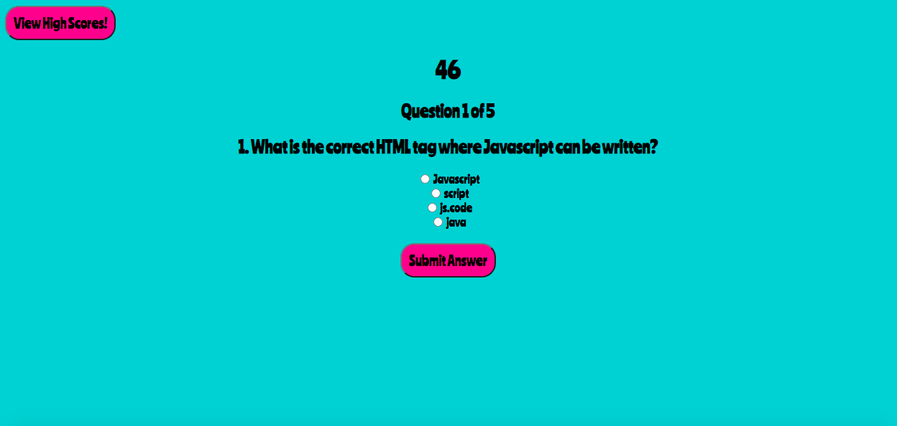

# web-apis
homework4

This repository features a quiz containing multiple-choice questions (about Javascript) that appear individually.  This quiz features a 60-second timer that counts backwards to zero.  The user gets one point for each correct answer submission.  If the user selects and submits an incorrect answer, then five seconds are deducted from the timer.  After the last question, the user can log their scores and initials.

This quiz features an HTML file, a CSS file, and a Javascript file that have been dynamically updated.  Most of the code is found in the js file.  The interface is clean, colorful, and responsive.

deployed: https://caseofbase18.github.io/web-apis/

Screenshot of Question 1: 